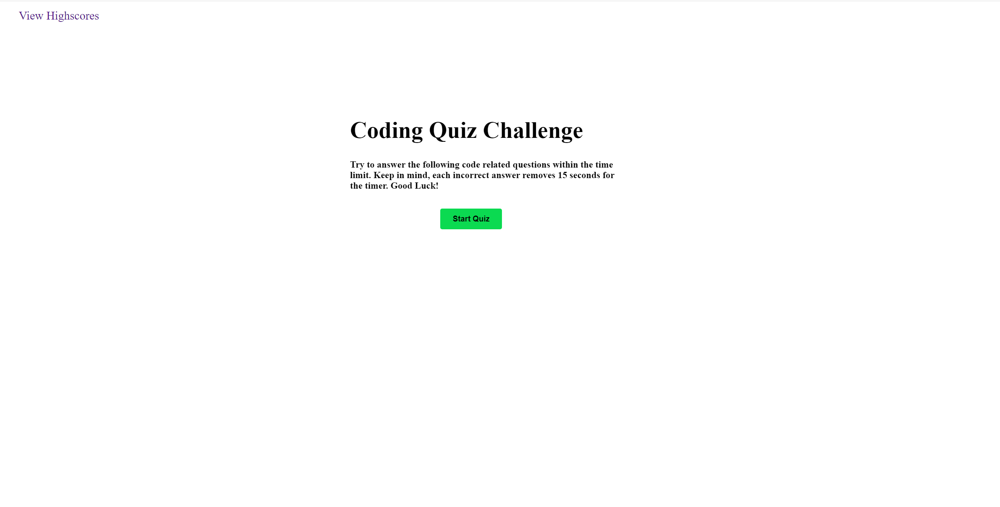

# Coding Quiz Challenge

## Description

This Website was used to produce a working quiz with the main focus on using Javascript and Web-API to develop it.

The quiz had to be able to record user selections, time the user and give a final score which was then to be recorded to local storage for a "Highscores" list.
 

## Usage

Deployed application:  
https://biscuit231.github.io/Coding-Quiz-Challenge/

## Credits

My Github:  
https://github.com/biscuit231/

Readme guide:  
https://coding-boot-camp.github.io/full-stack/github/professional-readme-guide

## License

MIT License